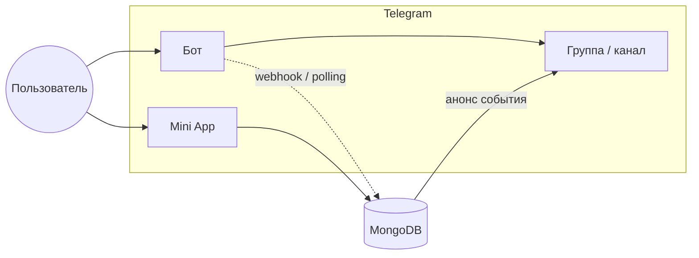

# Belgrade Friends Calendar

Telegram Mini App для общего календаря встреч: друзья создают события, отмечают «иду / возможно / не иду», подписываются на iCal и получают анонсы в групповом чате.

Интерфейс и тексты бота — **на русском**. Часовой пояс — **Europe/Belgrade**.

## Как это устроено



| Компонент | Папка | Назначение |
|-----------|--------|------------|
| **Mini App** | [`mini-app/`](mini-app/) | React + Vite: список событий, RSVP, настройки, подписка на календарь |
| **Сервер** | [`backend-api/`](backend-api/) | Один процесс Node.js: REST API + Grammy-бот (`/start`, `/setup`, webhook) |

Один Telegram-чат (`TELEGRAM_CHAT_ID`) = один общий календарь. Любой пользователь Telegram может открыть Mini App и залогиниться через `initData`.

## Возможности

- Создание и редактирование событий (автор или admin)
- RSVP: **иду** / **возможно** / **не иду**
- Отображаемое имя в календаре (поверх имени из Telegram)
- Ссылки на профили участников в Telegram
- Подписка на **Apple / Google Calendar** (все события или только «Иду»)
- Анонс нового события и уведомление об изменении в групповой чат
- Deep link из поста бота: `?startapp=event_<id>`

## Быстрый старт (локально)

**Требования:** Node.js 20+, Docker (для MongoDB).

```bash
git clone <repository-url>
cd belgrade-calendar   # имя папки после clone

docker compose up -d

cp .env.example .env
# Заполните: JWT_SECRET, BOT_TOKEN, TELEGRAM_ADMIN_IDS, TELEGRAM_CHAT_ID
```

Два терминала:

```bash
cd backend-api && npm install && npm run dev    # API + бот (polling), :3000
cd mini-app && npm install && npm run dev       # :5173
```

- Сервер: http://localhost:3000/health  
- Mini App: http://localhost:5173 (без Telegram auth не заработает — это ожидаемо)

### Тест в Telegram (ngrok)

1. Поднимите HTTPS-туннель на Mini App (`5173`).
2. В `.env` укажите `WEBAPP_URL` и `API_PUBLIC_URL` на ngrok-URL.
3. В [@BotFather](https://t.me/BotFather) → Menu Button → URL Mini App.
4. В группе: бот — админ, команда `/setup`.

Подробнее: [`mini-app/README.md`](mini-app/README.md), команды бота: [`backend-api/README.md`](backend-api/README.md#telegram-бот).

## Переменные окружения

Один файл `.env` в **корне** репозитория.

| Переменная | Описание |
|------------|----------|
| `JWT_SECRET` | Секрет для JWT |
| `MONGODB_URI` | MongoDB, по умолчанию `mongodb://127.0.0.1:27017/belgrade_calendar` |
| `BOT_TOKEN` | Токен бота |
| `TELEGRAM_CHAT_ID` | ID группы для анонсов |
| `TELEGRAM_ADMIN_IDS` | Telegram ID админов через запятую |
| `WEBAPP_URL` | HTTPS URL Mini App |
| `API_PUBLIC_URL` | Публичный base API (для iCal), на prod: `https://<домен>/api` |
| `BOT_WEBHOOK_URL` | Webhook на prod: `https://<домен>/bot/webhook` |
| `BOT_USE_POLLING` | `true` локально (по умолчанию), `false` на prod |

Полный пример — [`.env.example`](.env.example).

## Production

Целевой домен в проекте: **`belca.jtutor.app`**.

1. VPS: Node 20+, nginx, certbot, MongoDB (Docker или Atlas).
2. Сборка: `backend-api`, `mini-app` → статика в `/var/www/...`.
3. **Один процесс:** `backend-api` на `:3000` (pm2/systemd).
4. Nginx: `/` → Mini App, `/api/` → API, `/bot/webhook` → тот же `:3000`.
5. `BOT_USE_POLLING=false`, SSL, Menu Button в BotFather, `/setup` в группе.

```nginx
location /api/ {
    proxy_pass http://127.0.0.1:3000/;
}
location /bot/webhook {
    proxy_pass http://127.0.0.1:3000/bot/webhook;
}
```

Детали: [`backend-api/README.md`](backend-api/README.md), архитектура: [`docs/decisions.md`](docs/decisions.md).

## Структура репозитория

```
.
├── backend-api/      # API + Telegram bot (один процесс)
├── mini-app/         # Telegram Mini App (React)
├── docs/
│   └── decisions.md
├── docker-compose.yml
├── .env.example
└── req.md
```

## Документация

| Документ | Содержание |
|----------|------------|
| [backend-api/README.md](backend-api/README.md) | API, бот, endpoints, деплой |
| [mini-app/README.md](mini-app/README.md) | Экраны, ngrok |
| [docs/decisions.md](docs/decisions.md) | Модель данных, MVP / v1.1 |

## Лицензия

Самая свободная лицензия - MIT.